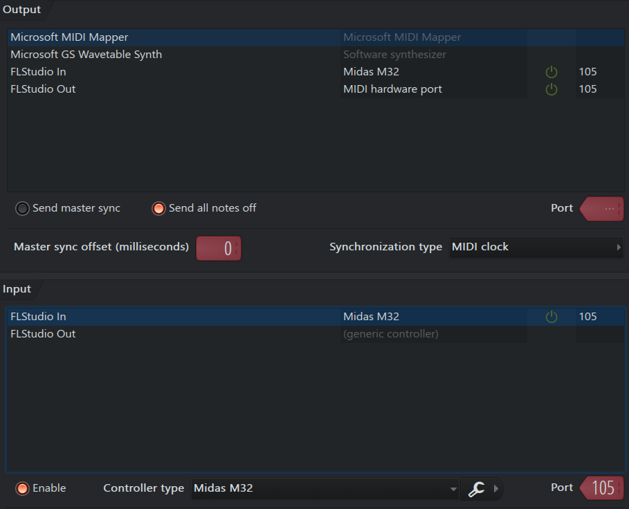
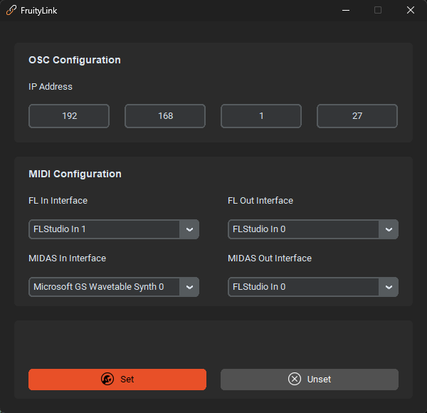

  

## ℹ️ Overview

**FruityLink** is a specialized bridge designed to integrate the **Midas M32** digital console with **FL Studio**. 
While most DAW integrations for the M32 are limited to basic Mackie Control (MCU) on 8 faders, FruityLink unlocks the console's full potential by mapping all **24 motorized faders** and the **lateral assign section** directly to the FL Studio mixer and transport controls.

#### Key Capabilities:
*   **Extended Surface:** Full bi-directional control of 24 tracks simultaneously across the M32 fader banks.
*   **Tactile Workflow:** Use the M32’s physical buttons and encoders to manage FL Studio’s lateral assignable parameters.
*   **Motorized Feedback:** High-precision synchronization between the DAW software and the Midas hardware.
*   **Optimized for FL Studio:** Custom MIDI scripting tailored specifically for the Image-Line workflow.

## ✍️ Authors

I'm Luigi a Computer Science and Engineering student specializing in Music and Acoustic Engineering. I'm passionate about music technology and always trying to design and implement new ideas.

## ⬇️ Installation

Further information coming soon.

## 🚀 Usage
#### DAW Configuration

  <kbd>
    
  </kbd>

1. Create two virtual MIDI interfaces (on Windows you can use for example [loopMIDI](https://www.tobias-erichsen.de/software/loopmidi.html) by Tobias Erichsen)
2. Assign one interface to the FL Studio input and one to the FL Studio output (in the FL Studio Audio/MIDI settings) along with an arbitrary port number. These ones need to be the same selected later in the FruityLink software as the communication interfaces with the DAW.
3. Check the "Enable" checkbox
4. Assign Midas M32 as a controller type (if you do not have this device type, look at the installation instructions up here)

#### Midas M32 Configuration
(Image coming soon)
1. Connect the mixer with an ethernet cable to the same LAN of the PC you are using and assign an IP address the way you prefere (static, DHCP, link local)
2. Connect the mixer also directly to the PC via USB cable/MIDI cable to enable sending/receiving midi

Remember that the 24 channels (faders, panpot, mute, solo, select) that are mapped as DAW controls are the 17-32 channels and 1-8 mixbus. In this way the first 16 input channels are left for use as recording interface or monitoring, and all the other channels (mixbus 9-16, matrix, Main LR, Main C) remain untouched.
(Further information on how to configure the midi assign section coming soon)

#### FruityLink Configuration

  <kbd>
    
  </kbd>

Double click on the downloaded executable (.exe) file. 

The user interface is made to keep it simple. All you need to do is to insert the ip address of the MIDAS M32 and select the correct MIDI input/output interfaces to/from the DAW and the mixer respectively. 

Then simply click "set" and leave the application running in background. You're all set and ready to go.

## 🧭 Roadmap

- [x] Core fader/panpot controls via OSC
- [x] Enable assign section controls via MIDI
- [x] Add feedback syncronization from the software to the controller
- [x] Add GUI for better user experience
- [x] Persistence for the GUI parameters
- [x] Release via single executable file
- [ ] Mapping for prev/next plugin preset of the plugin in the currently focused window
- [ ] Automatic assignment of the controls in the assign section via OSC (to avoid having to do it manually)

## 💬 Contributing
- **Bug Fixes**: If you find a bug, please [open an issue](https://github.com/TheLeewis/FruityLink/issues/new/choose) describing the steps to reproduce it.
- **Feature Requests**: Have a suggestion? Open an issue to discuss about it.

## ©️ Copyright
Copyright© 2026. 
#### 1. Permission to View and Copy
Permission is granted to any person obtaining a copy of this software and associated documentation files (the "Software") to download, view, and make local copies for personal, non-commercial purposes only.

#### 2. Restrictions
*   **Limited Modification:** You are permitted to modify, adapt, or build upon the Software solely for personal use or private study purposes. These modifications must not be shared or published.
*   **No Distribution:** You may not redistribute, share, sublicense, or publish the Software, or any portion thereof, to any third party or public platform.
*   **No Commercial Use:** You may not use the Software for any commercial purpose, including but not limited to selling, leasing, or using it in a commercial product or service.

#### 3. GitHub Specifics
While the Software is hosted on GitHub, you are permitted to "fork" this repository solely for the permitted purposes. This fork remains subject to all restrictions mentioned in Section 2.

#### 4. Reservation of Rights
The copyright holder reserves the right to modify the terms of this License or to re-license the Software under different terms (including open-source licenses) at any time. Any such changes will apply to all future copies or versions of the Software provided after the date of the change.

#### 5. No Warranty
THE SOFTWARE IS PROVIDED “AS IS”, WITHOUT WARRANTY OF ANY KIND, EXPRESS OR IMPLIED, INCLUDING BUT NOT LIMITED TO THE WARRANTIES OF MERCHANTABILITY, FITNESS FOR A PARTICULAR PURPOSE AND NONINFRINGEMENT. IN NO EVENT SHALL THE AUTHORS OR COPYRIGHT HOLDERS BE LIABLE FOR ANY CLAIM, DAMAGES OR OTHER LIABILITY, WHETHER IN AN ACTION OF CONTRACT, TORT OR OTHERWISE, ARISING FROM, OUT OF OR IN CONNECTION WITH THE SOFTWARE OR THE USE OR OTHER DEALINGS IN THE SOFTWARE.

#### 6. Non affiliation
This project is NOT affiliated, associated, authorized, endorsed by, or in any way officially connected with Image Line, Behringer or Mackie. All product and company names are trademarks™ or registered® trademarks of their respective holders.
